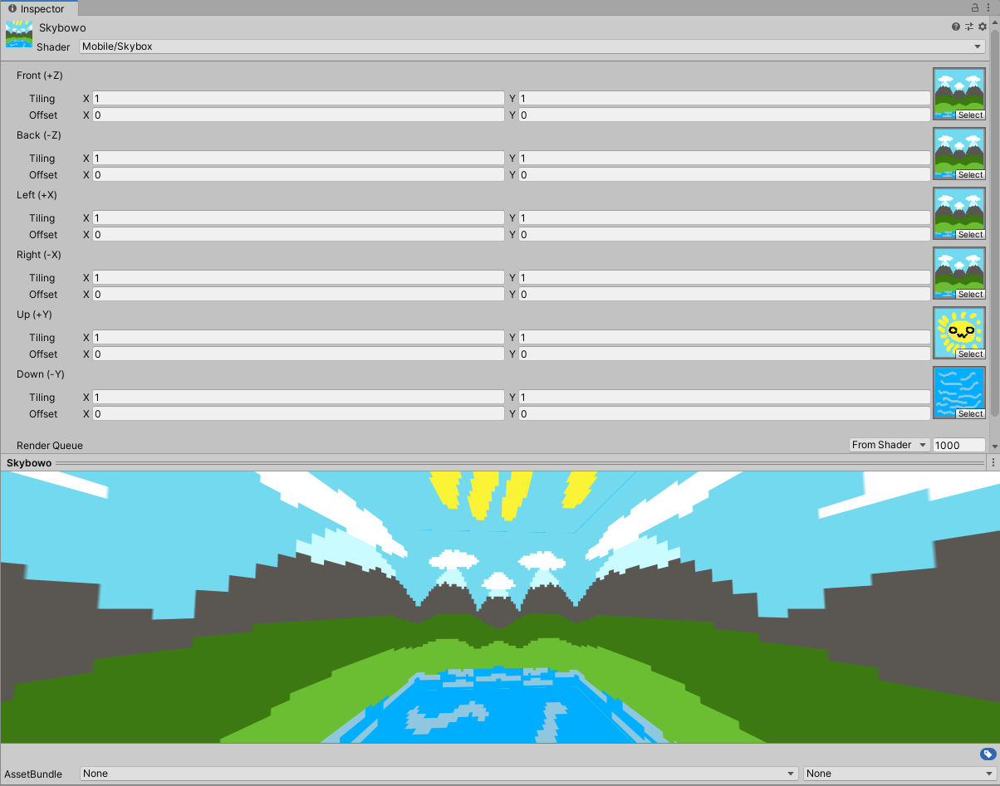

2. Lighting Overview & Lights
- Spotlight
- Directional Light
- Point Light
- Area Light

3. Materials & The Standard Shader
- For the material I remade I remade my mousepad. It's a matte finish and it's not very reflective so I put the metallic to 0 and the smoothness to 0 because it is not smooth
Then after that I put a normal map on it to give it that cloth kind of look and also added it to the heightmap to give it a little bit of depth as well.
Then I tiled it to make it very tiny so you can only really see it when you get close to it.

4. Textures
- I put a picture of myself and a picture of another person into the game and placed them over spheres and one picture of myself on a plane.
5. Skyboxes
- I made a skybox in Aseprite then ported it over by making a Skybox Material and put all the images in the skybox. Now it has sides and a bottom and top.

