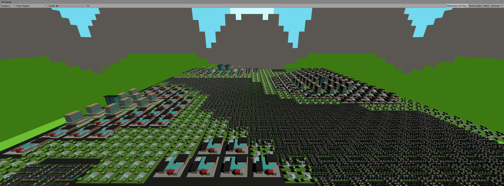
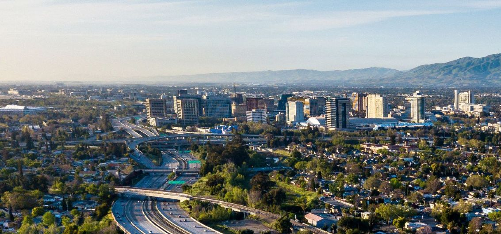

My City

San Jose

- For the city I wanted to recreate I remade San Jose my hometown :)
- There's a lot of suburbs so I made a little neighborhood of a lot of houses and stuff
- There's not that many skyscrapers or really tall buildings so I adjusted the rate of those
- I added malls/shopping centers cause there's a lot of those here
- There's a lot of parks too! But not too much.

Couldn't get ahold of partner
- Part 1
- I found the most challenging thing was making the assets for the city because you had to make about 5 different ones or more
- I thought the way they showed how the random distribution worked was really cool by visualizing it with a smoke png
